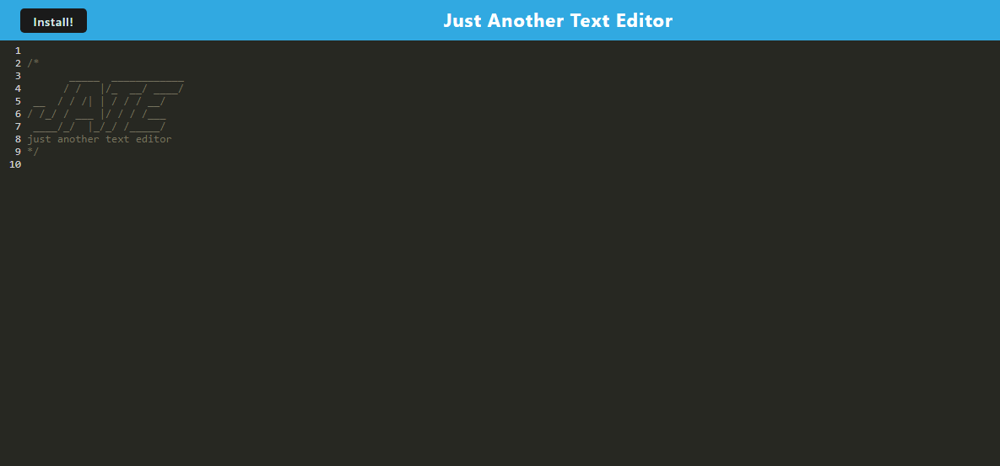

# Text Editor - J.A.T.E.

## Description
J.A.T.E. is just another text editor that runs as a Progressive Web Application using Webpack. Utilizing a service worker, the app allows users to optionally install it for offline use and/or enter information that will persist on the accessing device.

## Table of Contents
<a href="#description">Description</a>  
<a href="#usage">Usage</a>  
<a href="#installation">Installation</a>  
<a href="#license">License</a>  
<a href="#credits">Credits</a>  

## Usage
To use the app, access it at the deployed link:

to be added

Once you have accessed the app, you will be able to enter text onto the page. Any information you type into the text editor will be saved locally and persist. If you do not have an internet connection, you will still be able to access the app assuming you visited the deployed link at least once before, as the app uses a service worker to cache its information to your browser.

## Installation
If you would like, you may click the 'install' button to install the app directly onto your device, of which, it can be accessed by searching 'J.A.T.E.' on your device and clicking the app. 

## License
N/A

## Credits
Base code for this application was provided by UC Berkley